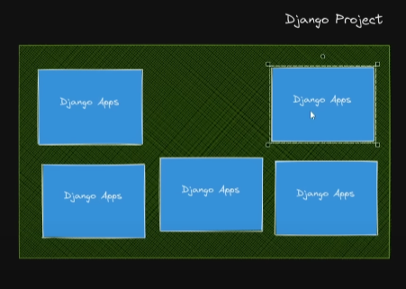

# Índice

- [Proyecto Django](#proyecto-django)
- [Tarea 1](#tarea-1)
- [Tarea 2](#tarea-2)
- [Crear el entorno virtual](#crear-el-entorno-virtual)
- [Request](#request)
- [Librerias adicionales](#librerias-adicionales)
- [Instalar DJANGO](#instalar-django)
- [Aplicaciones](#aplicaciones)
- [BDD PostgreSQL](#bdd-postgresql)
- [Eliminar venv y restaurar](#eliminar-venv-y-restaurar)

# Proyecto [Django](https://www.djangoproject.com/) &middot; [](https://github.com/django/django)[](https://docs.djangoproject.com/en/4.2/)

<p align="center">
  
</p>

[Leer como usar Django en tu proyecto](https://docs.djangoproject.com/en/4.2/).

## Tarea 1
Dada la siguiente API pública <https://api.citybik.es/v2/networks/bikerio> desarrolle los siguiente requerimientos:

-	Crear una función que obtenga la información presentada en la API pública (librerías a utilizar: requests, urllib3 o aiohttp).
-	Crear un modelo para la información obtenida.
-	Guardar en el modelo la información obtenida desde el API.
-	Opcional. Generar vista en el administrador para visualizar la información obtenida.
-	Opcional. Generar una vista con la información en Bootstrap 5 u otro similar.

## Tarea 2
Dada la siguiente url <https://snifa.sma.gob.cl/Sancionatorio/Resultado> desarrolle los siguiente requerimientos:

-	Crear un script para obtener la información presentada en la tabla de la url proporcionada (librerías a utilizar: BeautifulSoup o Selenium).
-	El script deberá recorrer todas las páginas y obtener la información de las tablas.
-	El script deberá crear un archivo .json con la información obtenida.
-	Generar modelo para guardar la información obtenida.
-	Opcional. Generar vista en el administrador para visualizar la información obtenida.
-	Opcional. Generar una vista con la información en Bootstrap 5 u otro similar.

# Crear el entorno virtual
1. Una vez dento de la carpeta madre, se crea el ntorno virtual. Primero se instala.
```js
pip install virtualenv
```

2. Creo ahora el entorno virtual.
```js
virtualenv venv
```
3. Ahora se debe ejecutar o activar.
```js
_./venv/Scripts/activate_
```
4. Finalmente con F1 puedo seleccionar el python que yo deseo para mi trabajo.

## Instalar DJANGO
```js
pip install django
```
```js
django-admin --version
```
Ahora para crear al proyecto inicial debemos utilizar el siguiente comando seguido de la carpeta como se llamara. ***El punto es para decirle que coloque la carpeta en la raiz y no que en la raiz realice una capeta y dentro de ella el proyecto.***
```js
django-admin startproject nombreDelProyecto 
```
```js
django-admin startproject myapp .
```
Para correr el archivo
```js
python manage.py runserver 8000
```


## Aplicaciones
Django ve asi las aplicaciones, se pueden ir quitando o agregando como funcionalidades

<p align="center">
  
</p>

```js
python manage.py startapp nombreAplicacion
```

## BDD PostgreSQL
- Instalar la bdd de datos a ocupar, luego configurarla en DATABASES{} (aplicacionBase/setting.py). Comandos Generales primero
```js
DATABASES = {
  'default': {
      'ENGINE': 'django.db.backends.postgresql_psycopg2',
      'NAME': 'extraction_request',
      'USER': 'postgres',
      'PASSWORD': 'root',
      'HOST': 'localhost',
      'PORT': '5432',
  }
}
```
```js
python manage.py makemigrations
```
```js
python manage.py migrate
```

- Crear la tabla en models.py y agregar en INSTALLED_APPS (setting.py) la aplicacion base.
- Ejecutar las migraciones
```js
INSTALLED_APPS = [
  'django.contrib.admin',
  'django.contrib.auth',
  'django.contrib.contenttypes',
  'django.contrib.sessions',
  'django.contrib.messages',
  'django.contrib.staticfiles',
  'web',
]
```
```js
python manage.py makemigrations nombreAplicacion
```
```js
python manage.py migrate nombreAplicacion
```
*Si la bdd se borro desde postgres, realizar pasos para la conexion desde el principio creando una nueva bdd*

## Eliminar venv y restaurar
Exportar la lista de paquetes mediante 
```js
pip freeze > requirements.txt
```
Luego cerrar el entorno y eliminar la carpeta.
Para restaurar, seguir los mismos pasos para crearlo: 
```js
python -m venv nombreENV
```
Activarlo y instalar las dependencias 
```js 
pip install -r requirements.txt
```
**Finalmente puedo crear las carpetas nuevamente y copiar los archivos con los comandos para cada aplicacion**.

### Sintaxis
| **NOMBRE** | **SÍMBOLO** |
|--------|--------|
| *Template inheritance* |  |
| *Jinja Loops* |  |
| *Static Files* |  |


## Librerias adicionales
```js
pip install selenium
```
```js
pip install webdriver_manager
```
```js
pip install request

pip install psycopg2
```

***El código se encuentra en la app web, en view hay que descomentar para que el boot realice el web scrapy***

### Estructura del proyecto
Esta estructura contempla las carpetas mas importantes con algunos archivos
```
request_selenium/
├── myapp/
│   ├── __init__.py
│   ├── settings.py
│   ├── urls.py
│   └── wsgi.py
├── web/
|   ├── extraction/
|   |   ├── tarea1_request.py
|   |   ├── tarea2_selenium.py
│   ├── migrations/
│   ├── templates/
│   │   ├── index.html
|   |   ├── navbar.html
|   |   ├── selenium.html
│   ├── static/
|   |   ├── css/
|   |   |   ├── main.css
|   |   ├── img/
|   |   |   ├── Aplicaciones.png
|   |   |   ├── Baldr.png
|   |   ├── json/
|   |   |   ├── procedimientos_sanitarios.json
│   ├── __init__.py
│   ├── admin.py
│   ├── apps.py
│   ├── models.py
│   ├── tests.py
│   └── views.py
├── .gitIgnore
├── manage.py
├── README.md
└── ...
